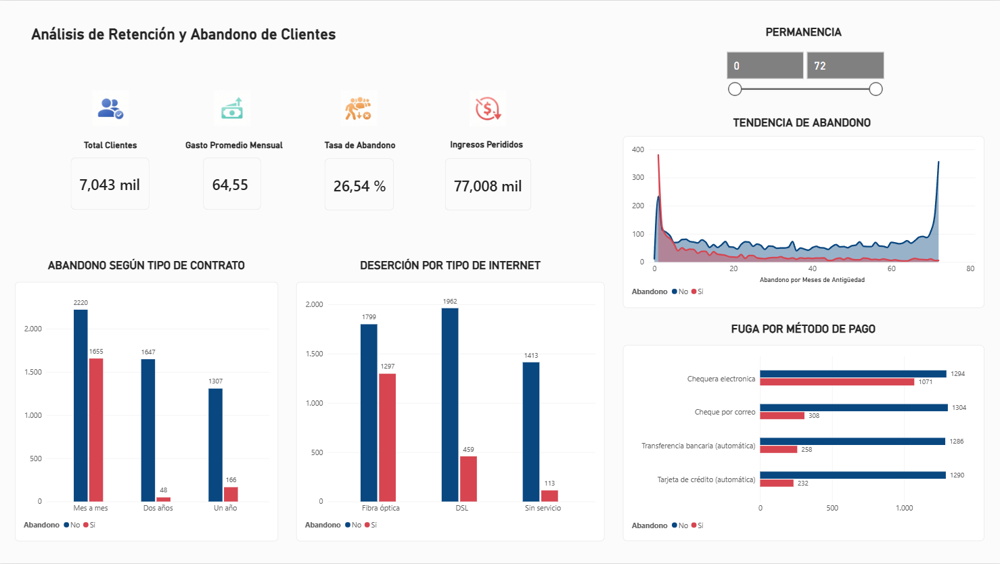

# 📊 Análisis de Retención y Abandono de Clientes (Telco Churn)

Proyecto de análisis de clientes orientado a identificar los principales factores asociados al abandono (Churn) y generar insights para apoyar estrategias de retención en una empresa de telecomunicaciones.

  

## 🎯 Descripción del Proyecto
Este proyecto simula un pipeline de datos completo y el desarrollo de un **Dashboard Ejecutivo en Power BI** enfocado en el análisis de clientes de telecomunicaciones. Los datos fueron procesados mediante scripts de **Python**, almacenados y consultados utilizando una base de datos **SQLite3**, y finalmente visualizados para identificar los factores críticos que impulsan la deserción (Churn) y respaldar la toma de decisiones estratégicas.

---

## 📂 Sobre los Datos
* **Origen**: Dataset público de telecomunicaciones obtenido de Kaggle (*Telco Customer Churn*).
* **Volumetría**: 7,043 registros de clientes y 21 variables analíticas.
* **Variable Objetivo**: `Churn` (indica si el cliente canceló el servicio o continúa activo).

---

## 🔄 Flujo del Proyecto
El desarrollo siguió un pipeline analítico de extremo a extremo:
---

## 🛠️ Tecnologías y Herramientas Utilizadas
* **Python**: Procesamiento inicial, automatización de la limpieza de datos y scripting.
* **SQLite3**: Gestión de la base de datos relacional local para el almacenamiento y consulta estructurada de los registros de clientes.
* **Power BI Desktop**: Creación del modelo de datos, diseño de interfaz UI/UX minimalista y desarrollo de visualizaciones interactivas.
* **Power Query (M)**: Transformación final, normalización de variables (tipos de contrato, métodos de pago, servicio de internet) y traducción de etiquetas al español.
* **Modelado de Datos & DAX**: Definición de KPIs personalizados y métricas de negocio.
* **Diseño UI/UX**: Estructuración de tarjetas flotantes, paleta de colores corporativa basada en alertas de riesgo y jerarquía visual orientada a la lectura ejecutiva.

---

## 📈 Principales KPIs del Tablero
* **Total Clientes**: 7,043 k
* **Gasto Promedio Mensual**: $64,55
* **Tasa de Abandono (Churn Rate)**: 26,54 %
* **Ingresos Perdidos**: $77,008 k

---

## 💡 Hallazgos y Business Insights Clave

1. **El Peligro Crítico del Primer Mes:**
   * El análisis de antigüedad (*tenure*) revela un pico masivo de cancelaciones concentrado drásticamente en los primeros 30 días. Los nuevos clientes que no logran encontrar valor o soporte rápido en su etapa inicial abandonan el servicio de forma exponencial. Quienes superan este umbral estabilizan su permanencia a largo plazo.

2. **Fricción Operativa en Métodos de Pago:**
   * Los métodos de pago manuales (como el cheque electrónico - *Electronic check*) presentan las tasas de deserción más altas de la base. En contraparte, los sistemas de cobro automático (tarjeta de crédito y transferencia bancaria) retienen de manera mucho más efectiva a los clientes.

3. **Impacto del Tipo de Contrato:**
   * Los contratos de tipo "Mes a mes" acumulan el mayor volumen absoluto de cancelaciones en comparación con los planes anuales o bianuales, evidenciando una baja barrera de salida para estos usuarios.

---

## 🏁 Conclusión
El análisis permitió identificar que la antigüedad del cliente, el tipo de contrato y el método de pago son factores determinantes en el abandono. Estos hallazgos aportan una base empírica sólida para diseñar estrategias de retención dirigidas y campañas preventivas enfocadas en los segmentos con mayor riesgo de fuga en su etapa inicial.

---

## 🚀 Cómo Visualizar el Proyecto
1. Puedes clonar este repositorio o descargar los archivos del proyecto.
2. Abre el archivo `.pbix` ubicado en la carpeta `dashboards` usando **Power BI Desktop** para interactuar con el filtro dinámico de permanencia por antigüedad.